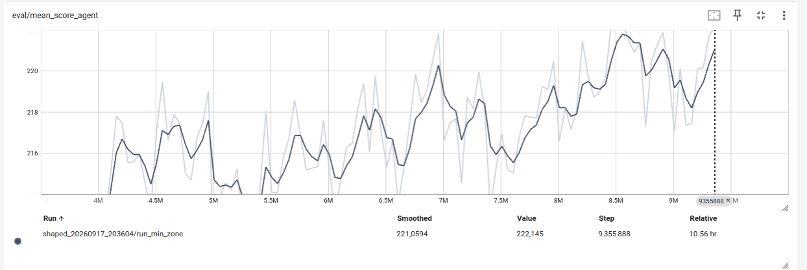

<div align="center">

# 🎲 Très Futé — Duel & Reinforcement Learning

**A game engine, a React interface and a MaskablePPO agent** for the two-player
variant of *Très Futé*.

[](https://www.python.org/)
[](https://fastapi.tiangolo.com/)
[](https://gymnasium.farama.org/)
[](https://stable-baselines3.readthedocs.io/)
[](https://pytorch.org/)
[](https://react.dev/)
[](https://www.typescriptlang.org/)
[](https://vitejs.dev/)
[](#-tests)

<sub>⚠️ A personal spec for a two-player **variant** — not the official commercial rulebook.</sub>

</div>

---

## 📖 Overview

This repository is a complete implementation of a two-player *Très Futé* duel:

- 🧠 **A pure rules engine** (`game_engine/`) that is the single source of truth, isolated from transport and rendering.
- 🌐 **A FastAPI service** (`api/`) that transports state, manages games and serves replays.
- 🎨 **A React + TypeScript interface** (`frontend/`): interactive board, auto-advance and a replay viewer.
- 🤖 **Two Gymnasium environments** (`rl_env/`, `rl_env_2/`) and a **MaskablePPO** training pipeline (`sb3-contrib`).
- 🎬 **A replay system**: checkpoints don't store the game, but the environment is deterministic, so any match is regenerated exactly from its seed.

<div align="center">
  
  <br />
  <sub>Training performance — TensorBoard tracking</sub>
</div>

---

## ✨ Features

| | |
|---|---|
| 🎲 **Complete game** | Two players on one screen, 6 turns, 5 score zones, pink/fox bonuses, reroll, joker and +1. |
| 🔒 **Centralised rules** | All logic lives in `backend/game_engine/`, versioned (`REGLES_DU_JEU.md` **v1.1**). |
| ⚡ **Stateless API** | In-memory store, per-game locking, idempotent `command_id`, `expected_version` to prevent desync. |
| 🖥️ **Front end without game logic** | React only renders and sends actions; no scoring, no validation. |
| 🧪 **Tested everywhere** | `pytest` on the Python side, `vitest` on the TypeScript side. |
| 🏋️ **Reproducible RL** | Everything is seeded; checkpoint opponent, reward curriculum and shaped rewards. |
| 🎬 **Built-in replays** | Regenerated JSON traces, served by `GET /replays`, browsable in the **Replay** tab. |
| ☁️ **Remote training** | Server-ready script (`scripts/run_shaped_remote.sh`) + TensorBoard over an SSH tunnel. |

---

## 🏗️ Architecture

```
                 browser (React + Vite)
                        │  REST /api
                        ▼
                 FastAPI (api/)  ──►  GameEngine (game_engine/)
                        │                   ▲
                        │                   │ reset / step
                        ▼                   │
                 replays JSON        rl_env / rl_env_2 (Gymnasium)
                        │                   ▲
                        └── GET /replays    │ action (int) + mask
                                     MaskablePPO (sb3-contrib)
```

```
tres_fute/
├── backend/
│   ├── game_engine/     # 🧠 pure rules + scoring (source of truth)
│   ├── api/             # 🌐 FastAPI: /games, /replays
│   ├── simulation/      # 🎮 games without HTTP (HeuristicPolicy)
│   ├── rl_env/          # 🤖 env v1: observation 1.0, 316 actions
│   ├── rl_env_2/        # 🤖 env v2: observation 2.0, 149 actions, checkpoint
│   ├── scripts/         # ☁️ run_shaped_remote.sh (server training)
│   └── runs/            # 💾 checkpoints & replays (gitignored)
├── frontend/            # 🎨 React + TypeScript + Vite
├── REGLES_DU_JEU.md     # 📜 variant specification (v1.1)
└── README.md
```

---

## 🚀 Quick start

### 1. Backend (API + engine)

```bash
cd backend
python3 -m venv .venv
source .venv/bin/activate
pip install -r requirements.txt
uvicorn api.app:app --reload --host 127.0.0.1 --port 8000
```

- Health check: `GET http://127.0.0.1:8000/health`
- Limits: **single uvicorn worker** (in-memory store), state lost on restart, no authentication.

### 2. Frontend (React board)

In a second terminal:

```bash
cd frontend
npm install
npm run dev
```

→ http://localhost:5173 (Vite proxies `/api` to `http://127.0.0.1:8000`).

<details>
<summary>Point the front end at another API</summary>

```bash
VITE_API_URL=http://127.0.0.1:8000 npm run dev
```
</details>

---

## 🤖 Reinforcement Learning environments

Two Gymnasium environments wrap the **same engine**. The second one is a
simplified, faster-to-learn variant.

| | `rl_env` (v1) | `rl_env_2` (v2) |
|---|---|---|
| 👁️ Observation | 51 keys, both players' boards | **53 keys**, 1-D agent board + 5 adversary scalars |
| 🎮 Actions | 316 | **149** (blue/turquoise bonuses factorised) |
| 🎁 Reward | `score_delta` / `terminal_score` | 4-term sequence (score → fox → zone → terminal) |
| 👥 Opponent | heuristic / random | heuristic / random / **checkpoint** |
| ⚖️ `gamma` | not exposed | **0.999**, exposed |
| 🏋️ Training | `train_maskable_ppo.py` | `train_sequence.py`, `train_solo_score_delta.py`, notebook `shaped_reward_training.py` |

### Train

```bash
cd backend && source .venv/bin/activate

# Solo run, reward Δ(score)/100
python rl_env_2/train_solo_score_delta.py --timesteps 4000000 --n-envs 4

# Sequential curriculum of 4 runs (score → fox → zone → terminal)
python rl_env_2/train_sequence.py --timesteps 1000000
```

### Shaped rewards (marimo notebook)

3 variants run in parallel (`min_zone`, `pbrs`, `variance`), 2M steps each,
launched from the notebook — or headless through the server script:

```bash
cd backend
marimo edit rl_env_2/shaped_reward_training.py     # 🎛️ interactive

scripts/run_shaped_remote.sh install               # ☁️ server (once)
scripts/run_shaped_remote.sh start                 # 3 parallel runs + TensorBoard
scripts/run_shaped_remote.sh status                # PIDs + metrics
```

Remote TensorBoard over an SSH tunnel:

```bash
ssh -N -L 6007:127.0.0.1:6006 <user>@<server>
# then http://localhost:6007
```

### Replay a model

```bash
cd backend && source .venv/bin/activate
python rl_env_2/watch_best_model.py \
  --model runs/solo_<timestamp>/score_delta_solo/best_model.zip --seed 2000000
```

Traces are written to `runs/<run>/replays/`, served by `GET /replays` and
displayed in the front end's **Replay** tab.

---

## 🧪 Tests

```bash
# Backend
cd backend && source .venv/bin/activate
pytest

# Frontend
cd frontend
npm test
```

---

## 📚 Documentation

| Document | Content |
|---|---|
| 📜 [`REGLES_DU_JEU.md`](REGLES_DU_JEU.md) | Normative specification of the variant (v1.1) |
| 🐍 [`backend/README.md`](backend/README.md) | Engine, API, routes, simulation, replays |
| 🤖 [`backend/rl_env/README.md`](backend/rl_env/README.md) | Gymnasium environment v1 |
| 🕹️ [`backend/rl_env_2/README.md`](backend/rl_env_2/README.md) | Environment v2, observations/actions 2.0, training |
| 🎨 [`frontend/README.md`](frontend/README.md) | React interface, board layout |

---

<div align="center">
<sub>Made with 🎲 and a lot of PPO — <b>Yike Ouyang</b></sub>
</div>
