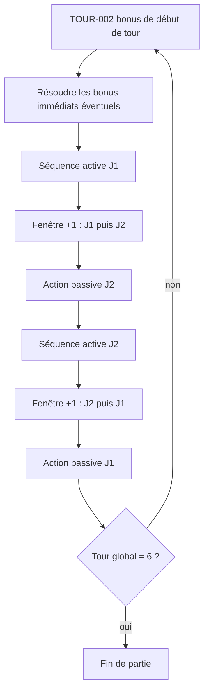

# Règles de la variante — Très Futé (duel à deux joueurs)

## A. Périmètre et statut

| Champ | Contenu |
| ----- | ------- |
| Jeu | Variante à **deux joueurs** du jeu de dés « Très Futé », jouée sur le même écran. |
| Objectif du document | Spécification normative permettant d’implémenter un moteur Python indépendant du front React et de FastAPI. |
| Date | 14 septembre 2026 |
| Version des règles | **1.2** |
| Statut | Spécification de **notre variante**. Ce n’est pas le règlement commercial officiel. |

**Sources effectivement consultées**

1. [`prompt/8backend.md`](prompt/8backend.md) — correctif ROSE-001 et cahier des charges de ce document (priorité 1).
2. Prompts utilisateur non remplacés : [`prompt/5c_bonusrose.md`](prompt/5c_bonusrose.md), [`prompt/7optimisation.md`](prompt/7optimisation.md), [`prompt/7bis_debug.md`](prompt/7bis_debug.md), [`prompt/6comptepoint.md`](prompt/6comptepoint.md), [`prompt/5b_emplacement.md`](prompt/5b_emplacement.md), [`prompt/5bonus.md`](prompt/5bonus.md), [`prompt/3duel.md`](prompt/3duel.md), [`prompt/2regles.md`](prompt/2regles.md) (uniquement les règles encore en vigueur).
3. Code du moteur React au 14 septembre 2026 : `frontend/src/game/{types,rules,reducer,bonuses,score,autoplay,debug}.ts`, `frontend/src/boardData.ts`, composants d’interface associés.
4. Tests exécutés : `frontend/src/game/pinkFirstCell.test.ts`, `frontend/src/game/plus1AndCounters.test.ts`.
5. Décisions utilisateur du 14 septembre 2026 (turquoise par groupe, +1 en chaîne, pistes de 7, renard de relance).

**Limites de vérification**

- Aucune suite de tests n’existait avant le correctif rose ; seuls les scénarios de `pinkFirstCell.test.ts` ont été exécutés automatiquement.
- Les autres règles sont documentées par lecture du code et des prompts, sans campagne manuelle exhaustive ni simulation de parties complètes pour ce document.
- Le générateur actuel (`Math.random()`) n’est pas ensemencé : le client React n’est **pas** reproductible. Le futur moteur Python devra l’être (voir L et O).
- Lorsqu’une règle utilisateur et le code divergent, la section O le signale. Les points O-01, O-02, O-03 et O-08 ont été appliqués dans le client.

**Règles remplacées — ne plus appliquer**

| Ancienne formulation | Remplacée par |
| -------------------- | ------------- |
| Première case rose = valeur effective brute ([`prompt/5c_bonusrose.md`](prompt/5c_bonusrose.md)) | ROSE-001 |
| Toutes les cases roses = `ceil(v/2)` sans choix ([`prompt/2regles.md`](prompt/2regles.md)) | ROSE-001 + ROSE-002 |
| Piste bleue de 11 cases, centre en position 6 | BLEU-001 (13 cases, centre en 7) |
| Cases turquoise foncées `6, 5, 4, 3, 2` | TURQ-001 (`6, 5, 3, 2, 1`) |
| Renard jaune en 2ᵉ rangée de bonus, colonne 6 ([`prompt/6comptepoint.md`](prompt/6comptepoint.md)) | BONUS-012 (1ʳᵉ rangée col. 6 = renard ; 2ᵉ rangée col. 6 = +1) |
| Bonus de tour cochés en **fin** de tour global ([`prompt/3duel.md`](prompt/3duel.md)) | TOUR-002 (début de tour) |
| Action passive limitée au carré gris, sans recours aux dés actifs ([`prompt/3duel.md`](prompt/3duel.md)) | PASS-002 |
| Turquoise passif/+1 : toujours compter le carré gris, même pour un dé actif ([`prompt/7optimisation.md`](prompt/7optimisation.md)) | TURQ-002 (groupe du dé joué) |
| Un seul +1 par joueur et par fenêtre | PLUS1-001 (enchaînement jusqu’à passer) |
| Compteurs joker/+1 de 6 cases ; dé marron à 4 jokers | Pistes de 7 ; dé marron et dé rose au 7e ; renard au 7e relance |
| Joker forcé dans l’ordre (`tokenIndex = used`), valeur figée par l’index | JOKER-001 v1.2 : valeur choisie, jetons utilisables **dans n’importe quel ordre** |
| Joker en phase `active` uniquement (O-04) | JOKER-002 v1.2 : utilisable en `active`, `passive`, `+1` et `fill-slots` |
| +1 sur tout dé, `location` indifférente | PLUS1-001 v1.2 : uniquement les dés `chosen` (joueur actif) + `discarded` (gris) |

---

## B. Glossaire

| Terme | Définition |
| ----- | ---------- |
| **Tour global** | Une des six itérations de la partie (`globalTurn` ∈ {1…6}). Chaque tour global contient deux séquences actives, deux fenêtres +1 et deux actions passives. |
| **Manche active** | Un lancer (ou relance des dés encore disponibles) suivi du choix et de l’utilisation d’un dé par le joueur actif. Une séquence active compte au plus trois manches, numérotées 1, 2, 3. |
| **Séquence active** | L’ensemble des manches actives d’un joueur pendant un tour global, y compris le complément d’emplacements sans effet s’il a lieu, jusqu’au transfert des dés restants vers le carré gris. |
| **Joueur actif** | Le joueur qui joue sa séquence active. Au début de chaque tour global, c’est le joueur 1. |
| **Joueur passif** | L’autre joueur. Il n’agit pas pendant la séquence active, puis joue **une** action passive après la fenêtre +1 qui suit cette séquence. |
| **Joueur qui doit prendre la décision courante** | Le destinataire de la prochaine action légale : propriétaire d’un overlay (bonus immédiat ou choix rose), sinon le joueur de la phase (`active`, `fill-slots`, `passive` non terminée, ou acteur +1 en cours). |
| **Dé disponible** | Dé dont `location = available`. Il peut être choisi pendant une manche active ; seuls ces dés sont relancés. |
| **Dé choisi** | Dé dont `location = chosen`. Il occupe un emplacement actif I, II ou III. |
| **Dé écarté** | Dé dont `location = discarded`. Il se trouve dans le **carré gris**. |
| **Dé ajouté sans effet** | Dé déplacé du carré gris vers un emplacement actif vide pendant la phase `fill-slots`. Aucun effet de plateau, aucun bonus, aucun lancer, aucune élimination. |
| **Valeur physique** | Entier 1…6 issu du dernier lancer de ce dé (`DieRuntime.value`). L’élimination des dés inférieurs utilise exclusivement cette valeur. |
| **Valeur effective** | `jokerValue` si un joker a été appliqué à ce dé, sinon la valeur physique. C’est la valeur utilisée pour la légalité, l’inscription et le turquoise (sauf mention contraire). |
| **Bonus stockable** | Relance, joker chiffre ou +1. Ils s’accumulent sur un compteur (`unlocked` / `used`) et se dépensent plus tard dans une fenêtre dédiée. |
| **Bonus immédiat** | Dé bonus de couleur (jaune, turquoise, bleu foncé, marron, rose) ou noir. Il n’est pas stocké ; il entre dans une **file de résolution** et doit être résolu avant la transition de phase différée. |
| **Renard** | Bonus de score permanent. Il ne se dépense pas, n’entre pas dans la file, et ne s’ajoute pas aux compteurs. |
| **Sélection provisoire** | Intention de coup (dé, couleur d’action, cases) qui n’a encore modifié ni le plateau ni les ressources, sauf le joker déjà appliqué au `SELECT_DIE` (voir JOKER-004). |
| **Action validée** | Coup dont les effets sont irréversibles : inscription ou coche, consommation de dé / +1, déblocage de récompense. |

**Positions vs valeurs**

- Les identifiants `yellow-r{l}-c{col}`, `turquoise-r{l}-c{col}`, `blue-cell-{n}`, `brown-cell-{n}`, `pink-cell-{n}`, `turn-{n}` désignent des **positions**.
- Les nombres imprimés (colonnes 1…6, piste marron, 7 central bleu) sont des **valeurs imprimées**.
- Les nombres écrits en bleu ou en rose sont des **valeurs inscrites**. Une position et une valeur inscrite ne se confondent pas : `blue-cell-8` est la première case de la branche droite, pas « la case qui vaut 8 ».

---

## C. Matériel et structure des plateaux

### C.1 Dés communs (données qui évoluent)

Six dés physiques, identité permanente, jamais dupliqués ni perdus (INV-001) :

| Identité | Couleur |
| -------- | ------- |
| `yellow` | Jaune |
| `turquoise` | Turquoise |
| `darkblue` | Bleu foncé |
| `brown` | Marron |
| `pink` | Rose |
| `white` | Blanc |

À chaque instant, chaque dé appartient à **exactement un** emplacement : `available`, `chosen` ou `discarded` (INV-002).

### C.2 Éléments propres à chaque joueur

Chaque joueur possède un plateau indépendant. Les identifiants moteur sont **sans préfixe**. L’interface DOM préfixe `p1-` / `p2-` ; le moteur Python n’a pas à reproduire ce préfixe.

#### Jaune — 3 × 6

| | c1 | c2 | c3 | c4 | c5 | c6 |
| --- | --- | --- | --- | --- | --- | --- |
| Ligne 1 | `yellow-r1-c1` | `yellow-r1-c2` | `yellow-r1-c3` | `yellow-r1-c4` | `yellow-r1-c5` | `yellow-r1-c6` |
| Ligne 2 | `yellow-r2-c1` | `yellow-r2-c2` | `yellow-r2-c3` | `yellow-r2-c4` | `yellow-r2-c5` | `yellow-r2-c6` |
| Ligne 3 | `yellow-r3-c1` | `yellow-r3-c2` | `yellow-r3-c3` | `yellow-r3-c4` | `yellow-r3-c5` | `yellow-r3-c6` |

Valeur imprimée d’une colonne = numéro de colonne = valeur de dé 1…6.

**Cases jaunes accessibles en phase passive et pendant un +1** (JAUNE-002) :

| Valeur du dé | Destination |
| ------------ | ----------- |
| 1 | `yellow-r3-c1` |
| 2 | `yellow-r3-c2` |
| 3 | `yellow-r2-c3` |
| 4 | `yellow-r2-c4` |
| 5 | `yellow-r1-c5` |
| 6 | `yellow-r1-c6` |

#### Turquoise — 5 × 6

Identifiants `turquoise-r{l}-c{col}`, lignes 1…5 du haut vers le bas, colonnes 1…6.

**Motif foncé TURQ-001** (depuis la gauche) :

| Ligne | Nombre de cases foncées | Colonnes foncées |
| ----- | ----------------------- | ---------------- |
| 1 | 6 | 1 à 6 |
| 2 | 5 | 1 à 5 |
| 3 | 3 | 1 à 3 |
| 4 | 2 | 1 et 2 |
| 5 | 1 | 1 |

Les autres cases sont claires. Toutes les cases, claires ou foncées, sont jouables et comptent pour le score. Seules les cases foncées conditionnent les bonus de ligne et de colonne.

#### Bleu — 13 cases

Identifiants `blue-cell-1` … `blue-cell-13`, de gauche à droite.

- Position 7 : **7 central fixe**, préimprimé, jamais modifié, jamais inscrit (BLEU-001).
- Branche gauche (depuis le centre vers la gauche) : positions `6, 5, 4, 3, 2, 1`.
- Branche droite (depuis le centre vers la droite) : positions `8, 9, 10, 11, 12, 13`.

#### Marron — 12 cases

Identifiants `brown-cell-1` … `brown-cell-12`. Valeurs préimprimées, gauche à droite :

`1, 5, 3, 4, 2, 6, 4, 5, 2, 1, 6, 3`

#### Rose — 12 cases

Identifiants `pink-cell-1` … `pink-cell-12`, gauche à droite. Voir le tableau unique en I.

#### Emplacements de dés sélectionnés

Trois emplacements I, II, III (`slots[0..2]`), correspondant aux manches 1, 2, 3. Ils appartiennent au joueur de la **séquence active en cours**. Au début d’une séquence active, ils sont vidés.

#### Carré gris

Ensemble commun des dés `discarded`. Unique pour les deux joueurs.

#### Compteurs de bonus (capacité 7)

Les trois pistes stockables ont **7 cases**, correspondant aux 7 sources du plateau (y compris les cases roses 2, 4, 5 et 8).

| Compteur | Représentation | Cases | Récompense de fin de piste |
| -------- | -------------- | ----- | -------------------------- |
| Relance | 7 cercles `↻` | 7 (`TOTAL_RELANCE`) | Renard (`counter-relance-all`) lorsque `unlocked ≥ 7` |
| Joker chiffre | `3, 4, 5, 6, ?, ?, ?` | 7 (`TOTAL_JOKERS`) | Dé marron (`counter-joker-all`) lorsque `unlocked ≥ 7` |
| +1 | 7 cases `+1` | 7 (`TOTAL_PLUS1`) | Dé rose (`counter-plus1-all`) lorsque `unlocked ≥ 7` |

La 7e case du compteur +1 est celle de `pink-cell-4` (option bonus). Ce n’est pas une source hors piste : elle remplit la piste comme les autres.

#### Marqueurs de tour

`turn-1` … `turn-6` sur chaque plateau. Cochés au **début** du tour global correspondant (TOUR-002).

### C.3 Données fixes vs données évolutives

**Fixes :** identifiants, dimensions, valeurs imprimées, motif turquoise foncé, tables de récompenses, barèmes, jetons joker `3,4,5,6,?,?,?`.

**Évolutives :** coches, valeurs inscrites, `brownLastChecked`, `brownDisabled`, `slots`, `chosenThisTurn`, compteurs, `slotsUnlocked`, dés (valeur, lieu, joker), phase, files, overlays, tour global.

---

## D. Initialisation et déroulement complet

### D.1 Ordre d’un tour global (TOUR-001)

L’ordre ci-dessous est celui du code (`endActiveSequence` : fenêtre +1 **avant** l’action passive). Il **corrige** le squelette du prompt 8, qui plaçait les fenêtres +1 trop tard.



Ordre exact des fenêtres +1 (PLUS1-001) :

1. Après la séquence active du joueur **A**, `order = [A, autre(A)]`. Les dés déjà rejoués dans cette fenêtre (`plus1UsedDice`) sont remis à zéro.
2. S’il n’a aucun +1 restant (`unlocked ≤ used`), l’acteur est sauté automatiquement.
3. S’il a au moins un +1 restant, il peut l’utiliser **ou** passer.
4. Après un +1 **réussi**, s’il lui en reste, il est ré-offert (enchaînement). Sinon, on passe à l’acteur suivant.
5. `PLUS1_SKIP` passe à l’acteur suivant, sans consommer les +1 restants (ils restent pour une fenêtre ultérieure).
6. Quand les deux acteurs ont été traités, l’action passive de `order[1]` commence.

Donc :

| Après la séquence active de | Fenêtre +1 | Puis action passive de |
| --------------------------- | ---------- | ---------------------- |
| Joueur 1 | J1 puis J2 | Joueur 2 |
| Joueur 2 | J2 puis J1 | Joueur 1 |

### D.2 Chronologie détaillée

1. **Initialisation** (`RESET` / nouvel état) : deux plateaux vides ; `createInitialState` appelle `beginGlobalTurn(..., 1)`.
2. **Attribution des bonus de début de tour** (TOUR-002) : pour le tour `N`, cocher `turn-N` sur **les deux** plateaux, J1 puis J2. Chaque source n’est accordée qu’une fois (`slotsUnlocked`).
3. **Résolution éventuelle avant le premier lancer** : si des dés bonus sont en file (tour 4 : noir J1 puis noir J2), les résoudre entièrement. Ensuite seulement, lancer les six dés et ouvrir la manche 1 du joueur 1.
4. **Manches actives du joueur 1** (au plus 3), éventuellement phase `fill-slots`, puis transfert des dés encore disponibles vers le carré gris.
5. **Fenêtre +1** J1 puis J2.
6. **Action passive du joueur 2** (un coup ou passer).
7. **Manches actives du joueur 2**, `fill-slots` éventuel, transfert.
8. **Fenêtre +1** J2 puis J1.
9. **Action passive du joueur 1**.
10. **Fin du tour global** : si `N < 6`, `CONTINUE` déclenche le tour `N+1` (étape 2). Si `N = 6`, phase `game-over` après résolution de tous les overlays restants.
11. **Fin de partie** : scores finaux ; aucune décision obligatoire ne doit rester en file (INV-008).

### D.3 Attentes vs transitions automatiques

| Situation | Attente d’une décision | Automatique |
| --------- | ---------------------- | ----------- |
| Manche active, au moins un dé jouable | Choix du dé / destinations / validation | Relance des dés disponibles au passage à la manche suivante |
| Aucun dé disponible jouable, manches restantes, emplacements vides | Choix des dés de complément | — |
| Séquence active terminée, 3 emplacements pleins | — | Transfert des disponibles → gris, ouverture +1 |
| Acteur +1 sans +1 restant | — | Saut vers l’acteur suivant ou le passif |
| Bonus immédiat en file | Résolution par le propriétaire | Enchaînement FIFO |
| Case rose 2…12 | Choix points ou bonus | — |
| Case rose 1 | Validation du coup (manuelle) ou auto-validation (avance rapide) | Inscription `ceil(v/2)` sans second choix |
| Action passive effectuée ou passée | `CONTINUE` | — |
| Tour 6, passif J1 terminé, files vides | `CONTINUE` | Passage en `game-over` |

---

## E. Cycle des dés

### E.1 Lancer et relancer (DES-001)

- Début de séquence active : les six dés sont relancés, tous `available` ; les emplacements du joueur actif et `chosenThisTurn` sont vidés ; le carré gris est vidé (les dés y sont réabsorbés par le relancer global).
- Manches 2 et 3 : **seuls** les dés `available` sont relancés. Choisis et écartés conservent leur valeur physique (et un éventuel `jokerValue` encore présent).
- Relance stockable : identique à un relancer des `available` uniquement ; les `jokerValue` des dés relancés sont effacés.

### E.2 Sélection d’un dé (DES-002)

Pendant une manche active, seuls les dés `available` sont sélectionnables. La sélection est provisoire jusqu’à validation, **sauf** application d’un joker (JOKER-004).

### E.3 Élimination (DES-003)

Après un coup actif validé :

1. Le dé sélectionné passe en `chosen` et occupe l’emplacement de la manche.
2. Tout autre dé `available` dont la **valeur physique** est **strictement inférieure** à `eliminationValue` (valeur physique du dé joué, **pas** la valeur effective du joker) passe en `discarded`.
3. Les dés de valeur physique égale ou supérieure restent `available`.

### E.4 Conservation des valeurs

Les dés choisis et écartés ne sont pas relancés tant que la séquence active n’est pas terminée et qu’une nouvelle séquence n’a pas tout relancé.

### E.5 Transfert de fin de séquence (DES-004)

Tous les dés encore `available` passent en `discarded`.

### E.6 Complément sans effet (DES-005)

Si la séquence active s’arrête (plus de dés disponibles, ou `END_TURN`, ou plus de coup légal) alors qu’au moins un emplacement I–III est vide :

1. Transférer d’abord les dés `available` vers le carré gris.
2. Le joueur actif choisit un dé `discarded` et le place dans le **premier** emplacement vide, sans effet.
3. Répéter jusqu’à ce que les trois emplacements soient occupés.

Conséquences ultérieures : le dé appartient désormais au groupe `chosen`. Il **n’est plus** dans le carré gris. Il ne reçoit pas d’entrée dans `chosenThisTurn` (la séquence active est close). Pour un +1 ou un turquoise passif, le groupe compté est celui du dé joué (`chosen` ou `discarded`).

### E.7 Répartition 3 / 3 (INV-003)

À la **fin** de la séquence active (après complément), il y a exactement 3 dés `chosen` et 3 dés `discarded`. Pendant les lancers, cette répartition n’est pas exigée.

### E.8 Recours passif aux dés actifs (PASS-002)

Pendant l’action passive normale :

1. Si au moins un dé `discarded` a un coup légal (toutes couleurs du blanc comprises, **sans** forcer un joker), seuls les dés `discarded` sont jouables.
2. Sinon, les dés `chosen` deviennent jouables, avec les règles **passives**.
3. Sinon, le joueur peut passer.

Turquoise de recours : compter les **autres** dés de même valeur effective présents dans le **carré gris**, même si le dé joué vient des emplacements actifs.

### E.9 Absence totale de coup légal

- Actif : message « Aucun coup possible. Terminez le tour. » puis `END_TURN` (dump + complément).
- Passif : message « Aucun coup possible. Vous pouvez passer. » puis `PASS_PASSIVE`.
- +1 déjà engagé sans dé jouable : le client propose `PLUS1_SKIP` (le +1 n’est pas consommé).
- Bonus immédiat impossible : stage `noMove`, résolution sans effet, le bonus n’est pas conservé.

---

## F. Règles de chaque couleur

Pour toutes les couleurs, un coup refusé laisse l’état et les ressources inchangés (INV-006), sous réserve de JOKER-004.

### F.1 Jaune (JAUNE-001 … JAUNE-003)

| Contexte | Entrée | Destination | Valeur utilisée |
| -------- | ------ | ----------- | --------------- |
| Actif | Dé jaune ou blanc joué en jaune | `yellow-r{manche}-c{valeurEffective}` | Effective |
| Passif et +1 | Idem | Table JAUNE-002 | Effective |
| Bonus virtuel jaune | Valeur choisie 1…6 | Toute case **non cochée** de la colonne = cette valeur (ligne libre) | Valeur choisie |

- Un seul clic de case ; impossible si la destination est déjà cochée.
- Le +1 utilise les restrictions passives, pas la ligne de manche (JAUNE-003).
- Le bonus virtuel n’utilise ni manche ni table passive.

### F.2 Turquoise (TURQ-002)

Colonne = valeur effective du dé (ou valeur choisie pour un bonus virtuel).

Nombre maximal de coches : `maxPick = min(1 + sameValueCount, casesLibresDansLaColonne)`.

Le joueur coche entre 1 et `maxPick` cases libres de cette colonne.

| Contexte | Groupe compté dans `sameValueCount` | Cases autorisées |
| -------- | ----------------------------------- | ---------------- |
| Actif | Dés déjà enregistrés dans `chosenThisTurn` (valeur **effective** stockée au moment du choix), hors le dé en cours | Colonne = valeur effective |
| Passif (dé du carré gris) | Autres dés `discarded` de même valeur effective, toutes couleurs | Colonne = valeur effective |
| Passif de recours (dé `chosen`) | Autres dés `chosen` de même valeur effective | Colonne = valeur effective |
| +1 | Autres dés **du même groupe** (`location`) que le dé joué | Colonne = valeur effective |
| Bonus virtuel turquoise | Aucun groupe de dés : **une** case turquoise **quelconque** non cochée | N’importe quelle case libre |

Règle unique hors phase active : `sameValueCount` = nombre d’autres dés dont `location` égale celle du dé sélectionné et dont la valeur effective est identique. Cela remplace l’ancienne consigne qui comptait toujours le carré gris, même pour un dé d’emplacement actif.

### F.3 Bleu foncé (BLEU-002)

**Somme :** `effective(darkblue) + effective(white)`, que ces dés soient disponibles, choisis ou écartés.

Pour chaque branche, `ref` = dernière valeur inscrite sur cette branche, ou **7** si la branche est vide. `nextFree` = première position encore vide en progressant depuis le centre. On ne saute jamais de case.

La somme peut être inscrite dans `nextFree` si :

- branche droite : somme = `ref + 1` **ou** somme = 7 ;
- branche gauche : somme = `ref - 1` **ou** somme = 7.

Un 7 inscrit dans une branche **ne remet pas** le compteur de progression à zéro : la case est remplie, `ref` devient 7 pour le prochain pas.

Une valeur inscrite ne peut jamais dépasser **12** : la somme vaut au plus 6 + 6. Le pas réglementaire n’est donc offert que s’il reste dans `1..12` (le pas gauche vaut au plus 6, le pas droit vaut 12 au maximum). En particulier, lorsque `ref = 12` sur la branche droite, la case suivante n’accepte plus que le 7.

Si une branche est pleine, elle n’offre plus de destination.

**Bonus virtuel bleu :** le joueur choisit, pour chaque branche encore ouverte, d’y inscrire soit la valeur réglementaire (`ref - 1` à gauche, `ref + 1` à droite) **dans la limite des valeurs légales (`1..12`)**, soit 7. Aucun dé physique n’est lu.

### F.4 Marron (MARR-001)

Une case `brown-cell-n` est légale si :

- la valeur imprimée égale la valeur effective (ou la valeur choisie du bonus) ;
- elle n’est pas cochée ;
- `n > brownLastChecked` (ou `brownLastChecked` est nul).

Plusieurs cases peuvent être légales ; le joueur en choisit une.

Après validation : la case est cochée ; toute case `k < n` non cochée devient **inaccessible** (`brownDisabled`) ; `brownLastChecked ← n`.

Les cases inaccessibles ne redeviennent jamais jouables et ne rapportent aucun point.

### F.5 Rose (ROSE-001 … ROSE-004)

Destination unique : première case vide de gauche à droite (`pink-cell-1` … `pink-cell-12`). Piste pleine ⇒ coup impossible.

La **valeur utilisée** est toujours la valeur effective (joker compris) ou la valeur choisie d’un bonus virtuel.

| Position | Inscription | Choix | Bonus |
| -------- | ----------- | ----- | ----- |
| 1 | `ceil(valeurEffective / 2)` | Aucun | Aucun |
| 2…12 | Voir ROSE-002 | Points **ou** bonus, avant toute inscription | Selon le tableau I |

Exemples ROSE-001 : 1→1, 2→1, 3→2, 4→2, 5→3, 6→3.

**ROSE-002** (cases 2…12) :

| Option | Valeur inscrite | Récompense |
| ------ | --------------- | ---------- |
| Points | `valeurEffective × multiplicateur` | Aucune (renard non débloqué) |
| Bonus | `ceil(valeurEffective / 2)` | Récompense de la case |

Rien n’est inscrit ni consommé tant que le choix n’est pas confirmé. L’annulation restaure la sélection (ou, pour un bonus rose virtuel, le choix de valeur) sans consommer de ressource.

**ROSE-003** : le score rose additionne les valeurs **déjà inscrites**. Il ne divise pas et ne multiplie pas une seconde fois.

**ROSE-004** : ces règles s’appliquent à tous les chemins : dé rose, blanc joué en rose, actif, passif, +1, joker, bonus immédiat rose ou noir joué en rose, avance automatique.

En mode manuel, la validation du coup (clic « Valider ») reste exigée y compris pour la case 1. Pendant l’avance rapide, cette validation est exécutée automatiquement ; seul le choix points/bonus est absent sur la case 1.

### F.6 Blanc (BLANC-001)

Le blanc conserve son identité physique. Le joueur choisit une **couleur d’action** parmi jaune, turquoise, bleu foncé, marron, rose. Le coup applique les règles de cette couleur avec la valeur effective du blanc.

Pour le bleu, la somme reste **blanc + bleu foncé**.

Le dé blanc va dans l’emplacement actif en tant que blanc.

---

## G. Bonus stockables

États d’une unité de compteur : **non débloquée** (`index ≥ unlocked`), **disponible** (`used ≤ index < unlocked`), **utilisée** (`index < used`).

Une piste de 7 cases est saturée à `unlocked = 7` ; les récompenses de fin se déclenchent à ce seuil.

### G.1 Relance (REL-001)

| | |
| --- | --- |
| Obtention | Sources `cumulative/relance` du tableau I |
| Fenêtre | Phase `active` uniquement, tant qu’il reste des dés `available` |
| Effet | Relancer tous les dés `available` ; effacer leurs `jokerValue` ; annuler `jokerPending` et la sélection provisoire |
| Consommation | Immédiate à l’activation (`used += 1`) |
| Annulation | Impossible après activation |
| Combinaisons | Peut précéder un joker ou un choix de dé dans la même manche |
| Récompense de piste | Renard `counter-relance-all` si `unlocked ≥ 7` |

### G.2 Joker chiffre (JOKER-001 … JOKER-005)

| Index du jeton | Valeur imprimée |
| -------------- | --------------- |
| 0 | 3 |
| 1 | 4 |
| 2 | 5 |
| 3 | 6 |
| ≥ 4 | Au choix 1…6 (joker « wild ») |

**JOKER-001 (v1.2)** : les jetons peuvent être consommés **dans n’importe quel ordre**. Le joueur choisit la **valeur** au démarrage du joker ; le moteur consomme le jeton débloqué non consommé correspondant (`available_joker_values` : valeurs des jetons débloqués non utilisés ; un jeton wild offre 1…6, et le jeton numéroté est prioritaire). `used` reste le nombre de jetons consommés ; `used_tokens` mémorise les indices.

| | |
| --- | --- |
| Fenêtre | `active`, `passive`, `+1` **et** `fill-slots` : utilisable dès qu’il y a des dés à choisir (résout O-04). |
| Paramètres | Choisir d’abord une valeur (valeurs disponibles), puis choisir un dé du **pool du contexte**. |
| Pool | `active` → dés `available` ; `passive` → `discarded` sinon `chosen` ; `+1` → `chosen`/`discarded` ; `fill-slots` → `discarded`. |
| Consommation | Au `SELECT_DIE` qui applique le jeton (`used += 1`, `used_tokens`, `jokerValue` posé). |
| Annulation avant application | `CANCEL_JOKER` : rien n’est consommé. |
| Annulation après application | `CANCEL_SELECTION` **n’annule pas** le joker (JOKER-004). |
| `fill-slots` | Le joker change la valeur du dé mais n’a **aucun effet de score** (phase sans effet plateau) ; le placement se fait via `fill_slot_dummy`. |

**JOKER-002 — valeur physique vs effective**

| Usage | Valeur |
| ----- | ------ |
| Légalité des destinations, inscription rose/jaune/marron, colonne turquoise, somme bleue | Effective |
| Élimination des dés inférieurs | Physique |
| Restriction d’avance automatique « éviter le max » manches 1–2 | Physique |
| Emplacement / identité du dé | Inchangés |

**JOKER-004** : si le dé transformé n’a ensuite aucun coup légal, le joker est **déjà consommé** et `jokerValue` demeure. Ce n’est pas une annulation.

**JOKER-005** : débloquer `unlocked ≥ 7` accorde le dé bonus marron `counter-joker-all` (une fois).

### G.3 +1 (PLUS1-001 … PLUS1-005)

| | |
| --- | --- |
| Fenêtre | Après chaque séquence active, avant le passif. L’acteur enchaîne ses +1 jusqu’à passer ou épuiser son stock. |
| Paramètres | Choisir un dé **pas encore rejoué par ce joueur dans cette fenêtre**, parmi les dés `chosen` du **joueur actif courant** et les dés `discarded` (zone grise) — jamais les dés `available` ; puis jouer avec les **règles passives** (jaune passif, turquoise selon F.2). |
| Consommation | Au coup +1 **validé** (`used += 1`, dé enregistré dans `plus1UsedDice[acteur]`). |
| Annulation | Annuler la sélection remet `plus1Active` à null **sans** consommer le +1 ni enregistrer le dé ; l’acteur peut réessayer ou passer. Passer (`PLUS1_SKIP`) ne consomme pas et cède la main. |
| Récompense de piste | Dé rose `counter-plus1-all` si `unlocked ≥ 7`. |

**PLUS1-004 — chaque dé au plus une fois par joueur.** Un même joueur ne peut pas rejouer le même dé physique deux fois dans la même fenêtre +1. L’autre joueur peut encore viser ce dé. Un dé déjà utilisé pendant la séquence active reste jouable au premier +1.

Le +1 ne lance pas, n’élimine pas, ne place pas dans un emplacement.

---

## H. Bonus immédiats et enchaînements (IMM-001)

Les dés bonus jaune, turquoise, bleu foncé, marron, rose et noir **ne sont pas stockables**.

Procédure :

1. Terminer le coup déclencheur (y compris inscriptions et compteurs).
2. Suspendre `pendingAdvance`.
3. Enfiler les dés bonus nouvellement obtenus, propriétaire = joueur dont le plateau a déclenché la source.
4. Résoudre FIFO. Un bonus peut en déclencher d’autres : ils sont ajoutés en queue et résolus avant la reprise.
5. Reprendre la transition différée seulement lorsque la file et l’overlay courants sont vides.

**File temporaire ≠ stock.** Impossible de garder un dé bonus « pour plus tard ».

| Couleur | Choix | Contraintes | Dés physiques |
| ------- | ----- | ----------- | ------------- |
| Jaune | Valeur 1…6 puis une case libre de cette colonne | Si aucune valeur n’a de case : sans effet | Aucun effet |
| Turquoise | Une case turquoise libre | Si aucune : sans effet | Aucun effet |
| Bleu foncé | Case + valeur réglementaire (`ref±1` ou 7) | Si aucune branche ouverte : sans effet | Aucun effet |
| Marron | Valeur 1…6 puis une case légale de cette valeur | Progression marron respectée | Aucun effet |
| Rose | Valeur 1…6 puis ROSE-001/002 sur la première case vide | Piste pleine : sans effet | Aucun effet |
| Noir | D’abord une couleur d’action, puis les règles de cette couleur | — | Aucun effet |

Un bonus impossible s’explique et se termine sans effet.

**IMM-002** : une source n’est accordée qu’une fois (`slotsUnlocked[slotId]`). `applyUnlocks` est idempotent et itère jusqu’à point fixe (pour enchaîner `counter-*-all`).

**IMM-003** : les sources roses `pink-2`…`pink-12` ne passent **pas** par `applyUnlocks` (prédicats toujours faux). Elles sont appliquées uniquement si l’option **bonus** de ROSE-002 est choisie. Cela empêche un double octroi via la détection générique.

Ordre déterministe des déblocements simultanés : ordre de `ALL_SLOTS` (tours, or, turquoise lignes, turquoise colonnes, bleu, intervalles marron, compteurs, pink affichés). Les dés bonus de J1 (tours) sont enfilés avant ceux de J2.

Un bonus immédiat s’applique **uniquement** au plateau de son propriétaire (INV-007).

---

## I. Table exhaustive des emplacements de récompenses

Les positions de cases, pas des paires de valeurs ambiguës.

### I.1 Début de tour (TOUR-002)

| ID | Zone | Emplacement | Condition | Récompense |
| -- | ---- | ----------- | --------- | ---------- |
| BONUS-001 | Tours | Sous `turn-1` | Début du tour global 1 | Relance |
| BONUS-002 | Tours | Sous `turn-2` | Début du tour global 2 | +1 |
| BONUS-003 | Tours | Sous `turn-3` | Début du tour global 3 | Joker chiffre |
| BONUS-004 | Tours | Sous `turn-4` | Début du tour global 4 | Dé noir |
| BONUS-005 | Tours | Sous `turn-5` | Début du tour global 5 | Aucune |
| BONUS-006 | Tours | Sous `turn-6` | Début du tour global 6 | Aucune |

Chaque ligne s’applique **à chaque joueur**, une fois.

### I.2 Fin de compteur

| ID | Zone | Emplacement | Condition | Récompense |
| -- | ---- | ----------- | --------- | ---------- |
| BONUS-007 | Compteur relance | À droite de la piste relance | `relance.unlocked ≥ 7` | Renard (`counter-relance-all`) |
| BONUS-007b | Compteur joker | À droite de la piste joker | `joker.unlocked ≥ 7` | Dé marron |
| BONUS-008 | Compteur +1 | À droite de la piste +1 | `plus1.unlocked ≥ 7` | Dé rose |

### I.3 Entre les lignes jaunes (or)

Déclenchement : les deux cases qui encadrent verticalement le bonus sont cochées.

**Première rangée de bonus** (entre les lignes de cases 1 et 2) :

| ID | Colonne | Entre | Récompense |
| -- | ------- | ----- | ---------- |
| BONUS-009 | 1 | `yellow-r1-c1` et `yellow-r2-c1` | Relance |
| BONUS-010 | 2 | `yellow-r1-c2` et `yellow-r2-c2` | Joker chiffre |
| BONUS-011 | 3 | `yellow-r1-c3` et `yellow-r2-c3` | Dé rose |
| BONUS-012a | 4 | `yellow-r1-c4` et `yellow-r2-c4` | +1 |
| BONUS-013 | 5 | `yellow-r1-c5` et `yellow-r2-c5` | Dé turquoise |
| BONUS-014 | 6 | `yellow-r1-c6` et `yellow-r2-c6` | **Renard** (`gold-r1-c6`) |

**Deuxième rangée de bonus** (entre les lignes de cases 2 et 3) :

| ID | Colonne | Entre | Récompense |
| -- | ------- | ----- | ---------- |
| BONUS-015 | 1 | `yellow-r2-c1` et `yellow-r3-c1` | Joker chiffre |
| BONUS-016 | 2 | `yellow-r2-c2` et `yellow-r3-c2` | Dé turquoise |
| BONUS-017 | 3 | `yellow-r2-c3` et `yellow-r3-c3` | Dé bleu foncé |
| BONUS-018 | 4 | `yellow-r2-c4` et `yellow-r3-c4` | Dé marron |
| BONUS-019 | 5 | `yellow-r2-c5` et `yellow-r3-c5` | Dé jaune |
| BONUS-020 | 6 | `yellow-r2-c6` et `yellow-r3-c6` | **+1** (`gold-r2-c6`) |

Correction la plus récente : renard au dernier emplacement de la **première** rangée ; +1 au dernier emplacement de la **deuxième**.

### I.4 Turquoise — à droite des lignes (cases foncées de la ligne)

| ID | Ligne | Cases foncées à cocher | Récompense |
| -- | ----- | ---------------------- | ---------- |
| BONUS-021 | 1 | `turquoise-r1-c1` … `c6` | Renard (`turqRow-1`) |
| BONUS-022 | 2 | `turquoise-r2-c1` … `c5` | +1 |
| BONUS-023 | 3 | `turquoise-r3-c1` … `c3` | Dé marron |
| BONUS-024 | 4 | `turquoise-r4-c1` et `c2` | Dé turquoise |
| BONUS-025 | 5 | `turquoise-r5-c1` | Aucune |

### I.5 Turquoise — sous les colonnes (cases foncées de la colonne)

| ID | Colonne | Cases foncées | Récompense |
| -- | ------- | ------------- | ---------- |
| BONUS-026 | 1 | r1…r5 c1 | Dé marron |
| BONUS-027 | 2 | r1…r4 c2 | Dé rose |
| BONUS-028 | 3 | r1…r3 c3 | Dé jaune |
| BONUS-029 | 4 | r1…r2 c4 | Joker chiffre |
| BONUS-030 | 5 | r1 c5 | Dé bleu foncé |
| BONUS-031 | 6 | r1 c6 | Relance |

### I.6 Cases bleues (la case est inscrite)

| ID | Position | Récompense |
| -- | -------- | ---------- |
| BONUS-032 | `blue-cell-1` | +1 |
| BONUS-033 | `blue-cell-2` | Dé rose |
| BONUS-034 | `blue-cell-4` | Dé jaune |
| BONUS-035 | `blue-cell-5` | Joker chiffre |
| BONUS-036 | `blue-cell-9` | Relance |
| BONUS-037 | `blue-cell-10` | Dé marron |
| BONUS-038 | `blue-cell-12` | Dé turquoise |
| BONUS-039 | `blue-cell-13` | Renard (`blue-13`) |

Positions 3, 6, 7 (centre), 8, 11 : aucune récompense.

### I.7 Intervalles marron (les deux cases encadrantes cochées)

| ID | Entre positions | Valeurs imprimées (indicatif) | Récompense |
| -- | --------------- | ----------------------------- | ---------- |
| BONUS-040 | 1 et 2 | 1 et 5 | Joker chiffre |
| BONUS-041 | 2 et 3 | 5 et 3 | Dé rose |
| BONUS-042 | 3 et 4 | 3 et 4 | Aucune |
| BONUS-043 | 4 et 5 | 4 et 2 | Relance |
| BONUS-044 | 5 et 6 | 2 et 6 | Dé turquoise |
| BONUS-045 | 6 et 7 | 6 et 4 | Aucune |
| BONUS-046 | 7 et 8 | 4 et 5 | +1 |
| BONUS-047 | 8 et 9 | 5 et 2 | Dé bleu foncé |
| BONUS-048 | 9 et 10 | 2 et 1 | Aucune |
| BONUS-049 | 10 et 11 | 1 et 6 | Dé jaune |
| BONUS-050 | 11 et 12 | 6 et 3 | Renard (`brownGap-11-12`) |

### I.8 Piste rose — tableau unique

| Position | ID case | Multiplicateur affiché | Récompense si option bonus | Traitement particulier |
| -------- | ------- | ---------------------- | -------------------------- | ---------------------- |
| 1 | `pink-cell-1` | Aucun | Aucune | ROSE-001 : inscription obligatoire `ceil(v/2)`, pas de dialogue |
| 2 | `pink-cell-2` | ×1 | Relance | ROSE-002 |
| 3 | `pink-cell-3` | ×2 | Dé bleu foncé | ROSE-002 |
| 4 | `pink-cell-4` | ×2 | +1 | ROSE-002 |
| 5 | `pink-cell-5` | ×1 | Joker chiffre | ROSE-002 |
| 6 | `pink-cell-6` | ×2 | Dé jaune | ROSE-002 |
| 7 | `pink-cell-7` | ×2 | Dé marron | ROSE-002 |
| 8 | `pink-cell-8` | ×1 | Relance | ROSE-002 |
| 9 | `pink-cell-9` | ×3 | Renard (`pink-9`) | Option points : `v×3` sans renard. Option bonus : `ceil(v/2)` + renard |
| 10 | `pink-cell-10` | ×2 | Dé bleu foncé | ROSE-002 |
| 11 | `pink-cell-11` | ×2 | Dé turquoise | ROSE-002 |
| 12 | `pink-cell-12` | ×3 | Dé noir | ROSE-002 |

### I.9 Les six renards (FOX-001)

| ID | Slot | Condition |
| -- | ---- | --------- |
| FOX-JAUNE | `gold-r1-c6` | `yellow-r1-c6` et `yellow-r2-c6` cochées |
| FOX-TURQ | `turqRow-1` | Six cases foncées de la ligne 1 turquoise cochées |
| FOX-BLEU | `blue-13` | `blue-cell-13` inscrite |
| FOX-MARR | `brownGap-11-12` | `brown-cell-11` et `brown-cell-12` cochées |
| FOX-ROSE | `pink-9` | Option **bonus** sur `pink-cell-9` |
| FOX-RELANCE | `counter-relance-all` | `relance.unlocked ≥ 7` |

---

## J. Scores (SCORE-001)

Les scores sont des fonctions pures du plateau. Ils sont **provisoires** pendant la partie (la valeur d’un renard suit le minimum courant) et deviennent définitifs à `game-over`.

On ne réapplique jamais un multiplicateur ni une division déjà utilisés à l’inscription (ROSE-003).

On distingue le **nombre de cases remplies/cochées** (ce qui entre dans les barèmes) de la **position atteinte** (marron : une case sautée n’est pas cochée).

### J.1 Jaune

Pour chaque ligne, selon le nombre de cases cochées (0…6), puis somme des trois lignes.

| Cases cochées | 0 | 1 | 2 | 3 | 4 | 5 | 6 |
| ------------- | - | - | - | - | - | - | - |
| Points | 0 | 2 | 6 | 12 | 20 | 30 | 42 |

### J.2 Turquoise

Pour chaque ligne, toutes les cases cochées (claires et foncées), puis somme des cinq lignes.

| Cases cochées | 0 | 1 | 2 | 3 | 4 | 5 | 6 |
| ------------- | - | - | - | - | - | - | - |
| Points | 0 | 1 | 3 | 6 | 10 | 15 | 21 |

### J.3 Bleu

Progression **indépendante** de chaque branche : nombre de cases **inscrites** depuis le centre (le 7 préimprimé ne compte pas). Ne pas additionner les paliers intermédiaires : prendre la valeur du palier atteint.

| Cases remplies dans une branche | 0 | 1 | 2 | 3 | 4 | 5 | 6 |
| -------------------------------- | - | - | - | - | - | - | - |
| Points de progression | 0 | 3 | 6 | 9 | 13 | 17 | 22 |

Puis **+4** pour chaque case (hors centre) dont la valeur inscrite ∈ {2, 3, 4, 10, 11, 12}.

`scoreBleu = progressionGauche + progressionDroite + 4 × nbValeursSpéciales`

Un 7 réinscrit dans une branche compte comme une case remplie pour la progression, mais n’est pas une valeur spéciale.

### J.4 Marron

Selon le **nombre total de cases cochées**. Les cases sautées / inaccessibles ne comptent pas.

| Cochées | 0 | 1 | 2 | 3 | 4 | 5 | 6 | 7 | 8 | 9 | 10 | 11 | 12 |
| ------- | - | - | - | - | - | - | - | - | - | - | -- | -- | -- |
| Points | 0 | 3 | 5 | 9 | 14 | 20 | 27 | 35 | 44 | 54 | 65 | 77 | 90 |

### J.5 Rose

Somme des valeurs inscrites sur `pink-cell-1` … `pink-cell-12`. Case vide = 0. Pas de seconde division.

### J.6 Renards

```
valeurRenard = min(scoreJaune, scoreTurquoise, scoreBleu, scoreMarron, scoreRose)
pointsRenards = nombreRenardsDébloqués × valeurRenard
```

Si une couleur vaut 0, chaque renard vaut 0. Les points des renards **n’entrent pas** dans le minimum.

### J.7 Total et égalité

```
sousTotal = jaune + turquoise + bleu + marron + rose
total = sousTotal + pointsRenards
```

Le plus grand total gagne. Totaux identiques : **égalité**, sans départage (SCORE-002).

Aucune contradiction de barème n’a été trouvée entre [`prompt/6comptepoint.md`](prompt/6comptepoint.md) et `score.ts`.

---

## K. Actions et transitions du futur moteur

Le moteur expose des **décisions de jeu**, pas des clics. Un agent RL n’a pas à reproduire « Valider » : une décision complète peut regrouper dé + couleur d’action + destinations + option rose éventuelle. L’interface actuelle découpe cette décision (présélection, bouton Valider) pour l’humain.

Un coup illégal est un no-op : état et ressources inchangés (INV-006), hors JOKER-004.

### K.1 Décisions de jeu

| Action | Acteur | Paramètres | Préconditions | Effets | Prochaine décision ou phase |
| ------ | ------ | ---------- | ------------- | ------ | --------------------------- |
| `SelectDie` | Joueur courant | Identité du dé | Phase active / passive / +1 engagé ; lieu autorisé ; overlay absent | Pose une sélection provisoire ; si joker en attente en actif : applique JOKER-004 | Choix blanc, cases, ou confirmation si destination unique |
| `ChooseWhiteColor` | Idem | Couleur d’action | Dé blanc sélectionné, `actingColor` nul | Fixe la couleur d’action et les destinations | Cases / confirmation |
| `PickCells` | Idem | Ensemble de cases ⊆ légales | Sélection avec couleur d’action | Met à jour les cases provisoires (turquoise : 1…maxPick) | Confirmation si ≥ 1 case |
| `ConfirmMove` | Idem | — (ou bundle équivalent) | Sélection complète | Écrit le plateau ; rose 1 : ROSE-001 ; rose 2…12 : ouvre `ChoosePinkOption` **sans** écrire | File de bonus ou transition différée |
| `CancelSelection` | Idem | — | Sélection ouverte | Efface la sélection ; en +1, quitte l’engagement sans consommer ; n’annule pas un joker déjà appliqué | Phase inchangée |
| `ChoosePinkOption` | Propriétaire de la case | `points` \| `bonus` | `pinkChoice` ouvert | Inscription ROSE-002 ; option bonus accorde la récompense | File de bonus ou reprise `PinkResume` |
| `CancelPinkOption` | Idem | — | `pinkChoice` ouvert | Rien d’inscrit ; si bonus virtuel, retour au choix de valeur | Sélection restaurée |
| `UseRelance` | Joueur actif | — | Phase active, relance disponible, overlay absent | Consomme 1 relance, relance les `available` | Choix de dé |
| `StartJoker` | Joueur actif | — | Phase active, joker disponible | Pose `jokerPending` (valeur du jeton ou wild) | `SetJokerValue` si wild, sinon `SelectDie` |
| `SetJokerValue` | Joueur actif | 1…6 | Joker wild en attente | Fixe la valeur du jeton | `SelectDie` |
| `CancelJoker` | Joueur actif | — | `jokerPending` sans application | Rien consommé | Choix de dé |
| `EndActiveEarly` | Joueur actif | — | Phase active, typiquement aucun coup | Dump des `available`, puis `fill-slots` ou fin de séquence | Complément ou fenêtre +1 |
| `FillSlotDummy` | Joueur actif | Dé `discarded` | Phase `fill-slots` | Dé → prochain emplacement vide, sans effet | Autre complément ou fenêtre +1 |
| `BeginPlus1` | Acteur de la fenêtre | — | Phase `plus1`, `plus1Active` nul, `unlocked > used` | Engage le replay | `SelectDie` (dés pas encore rejoués par cet acteur) |
| `SkipPlus1` | Acteur de la fenêtre | — | Phase `plus1` | Cède la main ; ne consomme pas les +1 restants | Acteur suivant ou passif |
| `PassPassive` | Joueur passif | — | Aucun des six dés n’est jouable | Marque le passif comme fait | `Continue` |
| `Continue` | Joueur dont le passif est `done` | — | Passif terminé, overlays vides | J2 passif → actif J2 ; J1 passif → tour suivant ou `game-over` | Voir D |
| `ChooseBonusColor` | Propriétaire | Couleur d’action | Bonus noir, stage `chooseColor` | Fixe la couleur effective | Valeur ou placement |
| `ChooseBonusValue` | Propriétaire | 1…6 | Stage `chooseValue` | Rose : ouvre ROSE-001/002 ; sinon placement | Placement / choix rose |
| `PlaceBonusBlue` | Propriétaire | Case + valeur | Bonus bleu en placement | Inscrit la valeur | File suivante |
| `PlaceBonusCell` | Propriétaire | Case | Bonus jaune / turquoise / marron en placement | Coche | File suivante |
| `DismissImpossibleBonus` | Propriétaire | — | Stage `noMove` ou aucune valeur jouable | Bonus perdu | File suivante |

### K.2 Conséquences automatiques (non des actions d’agent)

Lancers et relances de dés `available` ; élimination DES-003 ; `applyUnlocks` ; enfilage FIFO ; saut des acteurs +1 sans stock ; `pendingAdvance` (`activeNext`, `endActive`, `fillSlots`, `passiveDone`, `plus1Next`, `startTurn`) ; grant TOUR-002 ; fin de partie.

### K.3 Interactions purement visuelles

Ouvrir une fenêtre, présélectionner une destination unique, surligner les cases légales, afficher les scores provisoires, animer un dé. **Ce ne sont pas des règles de légalité.**

---

## L. État minimal à représenter en Python

### L.1 À stocker

| Groupe | Contenu |
| ------ | ------- |
| Plateaux `[1, 2]` | `checks`, `values`, `brownLastChecked`, `brownDisabled`, `slots[3]`, `chosenThisTurn`, `bonuses.{relance,joker,plus1}.{unlocked,used}`, `slotsUnlocked` |
| Dés | Pour chaque identité : `value` physique, `location`, `jokerValue` optionnel |
| Progression | `globalTurn`, `phase` (kind + paramètres), `plus1Active`, `plus1UsedDice`, `jokerPending` |
| Joueur devant agir | Dérivable, mais peut être mis en cache |
| Files | `pendingBonuses[]`, `bonusResolution`, `pinkChoice`, `pendingAdvance` |
| Sélection provisoire | `selection` ou `null` |
| RNG | Générateur **propre à la partie**, ensemencé. L’état interne du générateur n’entre **pas** dans l’observation destinée à l’agent. |

### L.2 Calculable (ne pas persister comme source de vérité)

Scores par couleur, sous-total, nombre de renards, valeur d’un renard, total ; destinations légales ; `maxPick` turquoise ; somme bleue ; liste d’actions légales ; messages d’interface.

### L.3 Reproductibilité (RNG-001)

Mêmes règles + même graine + mêmes actions + même politique d’appel au RNG (un tirage par dé relancé, dans un ordre d’identités fixe, p.ex. `ALL_DIE_COLORS`) ⇒ même trajectoire.

Le client React actuel appelle `Math.random()` sans graine : il n’est pas une référence de reproductibilité.

---

## M. Interface et avance automatique

Cette section **n’est pas** une règle de légalité.

| Comportement | Description |
| ------------ | ----------- |
| Présélection | Une seule destination légale est pré-cochée, encore provisoire. |
| Confirmation manuelle | L’humain clique « Valider ». L’agent peut fusionner ce clic dans `ConfirmMove`. |
| Mise en évidence | Cases légales / inaccessibles / foncées. |
| Scores permanents | Panneau provisoire sur chaque plateau, mis à jour après chaque action validée. Tableau comparatif seulement en `game-over`. |
| Avance automatique de N tours | Terminer le tour global en cours, puis N−1 tours de plus ; s’arrêter avant d’**initialiser** le tour suivant ; au tour 6, aller jusqu’à `game-over`. |
| Choix aléatoires | Parmi les actions légales, y compris « ne pas dépenser » un bonus facultatif. |
| Politique manches 1–2 | Si un dé **disponible** jouable a une valeur **physique** strictement inférieure au maximum physique des disponibles, exclure les dés de valeur maximale. Si tous égaux, ou si aucun inférieur n’est jouable, autoriser le max. **Ne s’applique pas** à la manche 3, au passif, au +1, aux bonus, au complément, ni pendant un joker en attente. |

**AUTO-001** : cette restriction appartient à la **politique** du joueur automatique. Le moteur et l’environnement RL doivent continuer d’offrir **tous** les coups légaux.

Plafond anti-boucle actuel : 8000 pas d’avance.

---

## N. Invariants et scénarios de référence

### N.1 Invariants

| ID | Propriété |
| -- | --------- |
| INV-001 | Les six dés physiques ne sont ni dupliqués ni perdus. |
| INV-002 | Un dé appartient à un seul `location` à un instant donné. |
| INV-003 | 3 `chosen` / 3 `discarded` à la fin de la séquence active, pas nécessairement pendant les lancers. |
| INV-004 | Une récompense n’est accordée qu’une fois par `slotId`. |
| INV-005 | Une annulation de sélection / choix rose / joker non appliqué ne consomme aucune ressource. (Exception documentée : JOKER-004.) |
| INV-006 | Une action illégale ne modifie pas l’état. |
| INV-007 | Une action ne modifie que le plateau de son bénéficiaire. |
| INV-008 | Les bonus immédiats sont résolus avant la transition normale. La partie ne se termine pas avec une décision obligatoire en attente. |

### N.2 Scénarios

Les états sont minimaux : seules les données pertinentes sont listées. `v(c)` = valeur inscrite.

#### N-01 — Première case rose, valeur paire (ROSE-001)

- **État :** piste rose vide ; J1 actif ; dé rose physique 4 sélectionné, destinations `pink-cell-1`.
- **Action :** `ConfirmMove`.
- **Résultat :** `v(pink-cell-1) = 2` ; pas de `pinkChoice` ; aucun bonus ; `scoreRose = 2`.

#### N-02 — Première case rose, valeur impaire (ROSE-001)

- **État :** identique, valeur effective 5.
- **Action :** `ConfirmMove`.
- **Résultat :** `v(pink-cell-1) = 3` ; `scoreRose = 3` (pas `ceil(3/2)`).

#### N-03 — Rose avec joker, puis choix sur une case ultérieure (JOKER-002, ROSE-002)

- **État :** `pink-cell-1` déjà inscrite ; J1 actif ; joker index 0 disponible (valeur 3) ; dé rose physique 6 disponible. Première case vide = `pink-cell-2` (multiplicateur ×1, bonus relance).
- **Actions :** `StartJoker` → `SelectDie(pink)` → `ConfirmMove` → `ChoosePinkOption`.
- **Résultat intermédiaire :** `jokerValue=3`, `eliminationValue=6` ; `pinkChoice` ouvert, `effectiveValue=3`, `multiplier=1`.
- **Si points :** `v(pink-cell-2)=3`, pas de relance.
- **Si bonus :** `v(pink-cell-2)=2`, `relance.unlocked += 1`.

#### N-04 — Joker : effective ≠ élimination (DES-003, JOKER-002)

- **État :** dés disponibles : rose 6, jaune 5, turquoise 2 ; joker 3 appliqué au rose.
- **Action :** coup rose validé (case 1 vide ⇒ inscrit 2).
- **Résultat :** rose `chosen` ; turquoise 2 écarté (2 < 6 physique) ; jaune 5 reste disponible (5 ≮ 6). L’élimination n’utilise pas 3.

#### N-05 — Turquoise actif, passif, +1, bonus immédiat (TURQ-002)

| Contexte | État pertinent | Coup | `maxPick` attendu |
| -------- | -------------- | ---- | ----------------- |
| Actif | `chosenThisTurn` contient déjà un 4 ; turquoise 4 ; colonne 4 entièrement libre | Turquoise 4 | 2 |
| Passif | Carré gris : turquoise 4, rose 4, marron 3 | Turquoise 4 | 2 (un autre 4 écarté) |
| +1 / recours sur un dé `chosen` | Turquoise 4 `chosen`, un autre 4 `chosen`, deux 4 `discarded` | Turquoise 4 | 2 (groupe `chosen` seulement) |
| Bonus | Aucune case turquoise cochée | Dé bonus turquoise | 1 case **quelconque** libre |

#### N-06 — Bleu avec partenaire déjà écarté (BLEU-002)

- **État :** branche droite vide (`ref=7`) ; `darkblue` choisi valeur 3 ; `white` écarté valeur 5.
- **Action :** jouer le bleu (ou le blanc en bleu).
- **Résultat :** somme 8 ; `blue-cell-8` légal (7+1). `blue-cell-6` illégal (pas 7−1=6).

#### N-07 — Redémarrage d’une branche bleue avec un 7 (BLEU-002)

- **État :** `blue-cell-8 = 8` ; `nextFree` droite = `blue-cell-9` ; `ref=8`.
- **Action :** bonus bleu ou somme 7, inscription en 9.
- **Résultat :** `v(blue-cell-9)=7` ; progression droite = 2 cases (6 points, pas 0) ; prochain pas droite : `ref=7`, accepte 8 ou 7.

#### N-08 — Cases marron sautées (MARR-001)

- **État :** piste marron vide ; dé 4.
- **Action :** cocher `brown-cell-4` (imprimé 4).
- **Résultat :** `brown-cell-1` (1), `brown-cell-2` (5), `brown-cell-3` (3) inaccessibles ; `brownLastChecked=4` ; score marron = 3 (une seule coche), pas 9.

#### N-09 — Enchaînement de bonus (IMM-001)

- **État :** J1 coche `yellow-r1-c3` alors que `yellow-r2-c3` l’est déjà.
- **Résultat :** `gold-r1-c3` débloque un dé rose ; overlay rose pour J1 **avant** la manche suivante ; si J1 joue rose case ≥ 2 option bonus d’un dé couleur, ce dé s’ajoute en queue.

#### N-10 — Attribution des bonus au début d’un tour (TOUR-002)

- **État :** fin du tour 3, passif J1 `done`, files vides.
- **Action :** `Continue`.
- **Résultat :** `turn-4` coché sur J1 et J2 ; file `[ {J1, black}, {J2, black} ]` ; résolution J1 puis J2 **avant** le lancer de la séquence active J1. Pas de seconde attribution au changement de joueur actif.

#### N-11 — Complément des dés actifs sans effet (DES-005)

- **État :** manches 1–2 jouées (2 `chosen`) ; plus de `available` ; 4 `discarded`.
- **Action :** deux `FillSlotDummy`.
- **Résultat :** 3 `chosen`, 3 `discarded` ; aucune nouvelle coche ; `chosenThisTurn` inchangé par ces déplacements.

#### N-12 — Recours passif aux dés actifs (PASS-002)

- **État :** 3 dés gris sans aucun coup (blanc compris) ; au moins un `chosen` jouable en passif.
- **Résultat :** message de recours ; seuls les `chosen` sont sélectionnables ; le coup reste passif (jaune = table JAUNE-002).

#### N-13 — Renard rose selon l’option (FOX-ROSE)

- **État :** `pink-cell-1`…`8` remplis ; valeur effective 4 sur la case 9.
- **Option points :** `v(pink-cell-9)=12` ; `slotsUnlocked[pink-9]` absent ; `foxCount` inchangé.
- **Option bonus :** `v(pink-cell-9)=2` ; `slotsUnlocked[pink-9]=true` ; `foxCount += 1` ; pas d’overlay supplémentaire.

#### N-14 — Fin de partie après les derniers bonus (TOUR-001, INV-008)

- **État :** tour 6, passif J1 validé qui débloque un dé bonus.
- **Résultat :** le dé bonus est résolu **avant** `game-over` ; ensuite `Continue` → `game-over` ; tableau des scores ; égalité possible.

#### N-15 — Score rose sans double division (ROSE-003)

- **État :** `pink-cell-1=3` (ROSE-001 appliqué à une valeur effective 5) et `pink-cell-2=4` (ROSE-002 option points, valeur effective 4, multiplicateur ×1).
- **Calcul :** `scoreRose = 3 + 4 = 7`. Le moteur n’applique ni `ceil(3/2)` ni un second ×1.

---

## O. Écarts et décisions à confirmer

Légende du statut : **confirmé** = instruction utilisateur encore en vigueur ; **code** = comportement observé ; **hypothèse** = reformulation non tranchée.

| ID | Sujet | Règle explicite disponible | Comportement du code | Écart ou ambiguïté | Impact sur le moteur |
| -- | ----- | -------------------------- | -------------------- | ------------------ | -------------------- |
| O-01 | Turquoise : groupe du dé joué | Décision du 14 sept. 2026 : compter les dés du **même groupe**. | `location` du dé sélectionné en mode passif / +1. | **Tranché.** Remplace le prompt 7 (toujours le carré gris). | `maxPick` turquoise |
| O-02 | Taille des compteurs et « tous les +1 » | Les trois pistes ont 7 cases. La case rose 4 est la 7e source de +1. | `TOTAL_* = 7` ; dé rose / marron / renard au 7e. | **Tranché.** | BONUS-007, BONUS-008, FOX-RELANCE |
| O-03 | Dés au +1 | Plusieurs +1 enchaînables ; chaque dé au plus une fois **par joueur**. | `plus1UsedDice` par fenêtre. | **Tranché.** | PLUS1-004 |
| O-04 | Joker hors phase active | Prompt 5 : utilisable en transformant un dé, sans borner la phase. | `START_JOKER` refusé hors `active`. | **Tranché (v1.2)** : utilisable en `active`, `passive`, `+1` et `fill-slots`. | Fenêtres JOKER-001. |
| O-05 | Consommation du joker si le coup est ensuite impossible | « Ne consommer ni le dé ni la manche » si aucune destination. Rien sur le joker. | Le joker est consommé au `SELECT_DIE`, avant le test de légalité post-joker. | **À confirmer** si un joker « à blanc » doit être rendu. | Politique JOKER-004. |
| O-06 | Générateur aléatoire | Le futur moteur doit être reproductible (prompt 8). | `Math.random()` global, sans graine. | Écart attendu : le Python doit introduire une graine par partie. | RNG-001. |
| O-07 | Sources roses dans `applyUnlocks` | Bonus rose au moment du choix points/bonus (prompt 5c). | Prédicats `pink-*` toujours faux ; octroi uniquement via `PINK_CHOOSE` option bonus. | Cohérent avec 5c, différent d’une détection générique. À conserver. | Idempotence INV-004. |
| O-08 | Plusieurs +1 par fenêtre | Décision du 14 sept. 2026 : enchaîner jusqu’à passer. | Même acteur ré-offert tant que `unlocked > used`. | **Tranché.** | PLUS1-001 |
| O-09 | Persistance de `jokerValue` jusqu’au prochain relancer / nouvelle séquence | Joker « pour la valeur d’un dé ». Commentaire code : temporaire pour la séquence. | Non effacé par `CANCEL_SELECTION` ni par la fin de séquence (seulement relance des `available` ou `rollAllDice` du tour suivant). | Un dé écarté peut conserver un `jokerValue` jusqu’à la séquence suivante. | Observation et légalité turquoise/bleu au passif/+1. |

Les points O-01, O-02, O-03, O-04 et O-08 ont été tranchés et appliqués. Les autres ambiguïtés (O-05, O-06, O-09) restent ouvertes pour le moteur Python.

---

## Annexe — Identifiants de règles (index)

| Préfixe | Thème |
| ------- | ----- |
| TOUR-00x | Tours globaux, bonus de début de tour |
| DES-00x | Cycle des dés |
| PASS-00x | Action passive |
| JAUNE / TURQ / BLEU / MARR / ROSE / BLANC | Couleurs |
| REL / JOKER / PLUS1 | Bonus stockables |
| IMM / BONUS / FOX | Bonus immédiats, sources, renards |
| SCORE / AUTO / RNG / INV | Scores, politique auto, aléatoire, invariants |
| O-0x | Décisions ouvertes |

## Annexe — Tests réellement exécutés (14 septembre 2026)

```
frontend$ npm test
✓ src/game/pinkFirstCell.test.ts (7 tests)
✓ src/game/plus1AndCounters.test.ts (10 tests)

frontend$ npm run build
tsc && vite build : succès
```

Non vérifié : parties complètes manuelles, avance automatique multi-tours, rendu navigateur des pistes à 7 cases.
